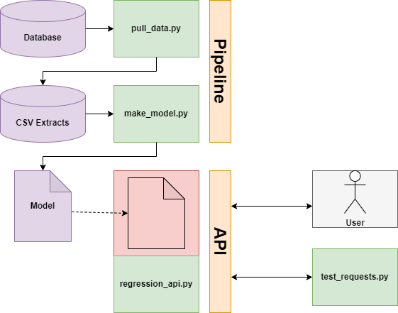

# Transportation Hub Pipeline

This project is a proof-of-concept of how to execute a basic [machine learning pipeline](https://cookiecutter-data-science.drivendata.org/v1/).

```bash
.
├── data/                # Directory where pulled data goes.
├── docs/                
├── models/              # Directory where generated models go.
├── notebooks/           
├── references/          
├── reports/             
├── src/                 # Directory where source code goes.
├── Makefile             # Runner for common operations.
├── README.md
└── requirements.txt
```


### Prerequisites

* Linux or WSL
* Python 3
* [make](https://www.gnu.org/software/make/)


### Setup

`$make env`

Creates a Python virtual environment and installs the necessary dependencies.

```bash
$export PIPE_USER="your_username_here"
$export PIPE_PW="your_password_here"
```

Configures the username and password used when connecting to Snowflake.


### Basic Usage

`$make all`

Pulls down data from Snowflake and creates a simple machine learning model.

`$make deploy`

Deploys the toy model as a local API, which can take inputs and return predictions.

`$make test_api`

Launch several test API calls, printing inputs and outputs.

### Architecture Sketch




### Further Reading

* [Machine Learning in Production: From Models to Products](https://mlip-cmu.github.io/book/01-introduction.html)

* [Cookiecutter Data Science Template](https://cookiecutter-data-science.drivendata.org/)